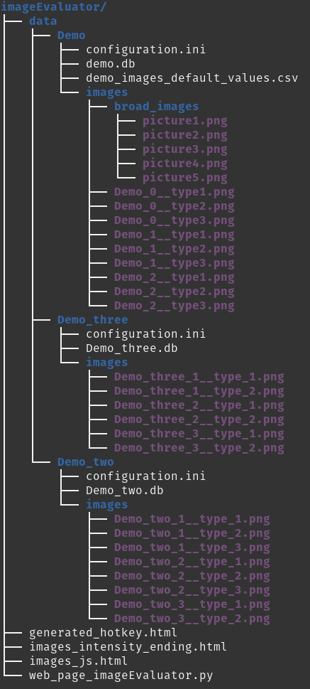
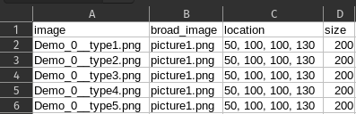

# Image Evaluator
A tool for generating a web page to let evaluaters answer question for images. The imageEvaluator stores the responces to in a SQLite and/or comma-separated values (csv) file. Each created questionnaire has it's

## Getting started
### Images:
In the images folder store your images that need to be rated following this namingstructure for each image:
{sample_name}__{type}.{extension} or navigate to the imageEvaluator directory and use the mkquest.sh command in the terminal to make a new questionnaire.


  
*ImageEvaluator Questionnaire Directory Structure*

### Questions:
In the configurations.ini file add your questions under `[Questions]` and above `[End_questions]`:
```ini
[QUESTIONS]
  [Question0]
  Question_type = text_input
  Question_discription = Enter optional comment.

  [question1]
  Question_type = selection_box
  Question_discription = selectionbox question
  Options = option1, option2, option3
```
Or bind a hotkey to an answer by adding <'keystroke> after an option in Options
```ini
  [question2]
  Question_type = multiple_choice
  Question_discription = multiple_choice_question
  Options = option1 <1>, option2 <2>, option3 <3>
[End_questions]

```

### Further Configurate:
In the configurations.ini file other adjustments can be done like:
image_display, database storage, extra text, ...

### Optional mapping:
A csv file with mappings can be added to the questionnaire directory where images 
A mapping csv file with following form:
  
  `
  <name_of_questionnaire>_images_default_values.csv
  `
  
  
  
can be created for each image in the directory of the questionnaire this change the image to the values(size,broad_image,location) in the mapping when they are displayed instead of the ones in the configuration.ini file.

#### Explanation of collums:
- **id**: Name of image where the following variables apply.

- **size**: an integer for the image size.

- **broad_image**: Name of broad image found in the  "*~/imageEvaluator/data/<name_of_questionnaire>/images/broad_images/*"  directory that will be renderd when the "id images" are displayed.

- **location**: Coordinates of the red square that will be drawn on the "broad_image", an input value of  this collum has the following form:
int,int,int,int   (which specifies a diagonal of the "red square").

- **scale_bar_text**: text of the scale bar

- **scale_bar_length**: the length of the desired scale bar in pixels on the original image.
  
  
  
## Generating the web page:
when images, questions and other adjustments are made run following streamlit command to render webpage:
```bash
streamlit run web_page_imageEvaluator.py
```
